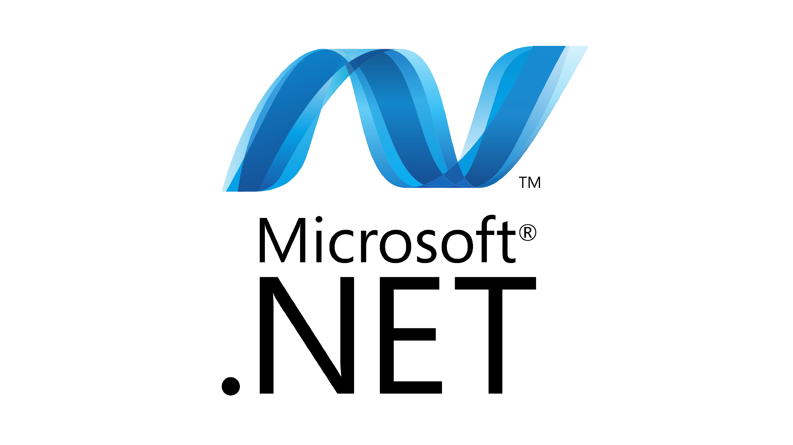

# Платформа .NET

Зачем разработчикам еще один язык программирования? Что такое платформа и где сейчас применяют .NET. Посмотрим на особенности хедлайнера платформы C# и его спутника F#.



__Место проведения:__ Under Митап #1, г. Владимир, ул. Гагарина 14, этаж -1, [конф. зал отеля Русь](https://yandex.ru/maps/-/CHGU5N06).

30 мая 2025 года. ▶ Видео не производилось, ¿возможно аудио?

## План

- Все сейчас в некотором роде программисты.
- Пирамида языков.
- История создания и таймлайн развития платформы.
- Состав экосистемы.
- Как это работает.
- Кем, где и когда применяется.
- F# дарит C# функциональные фишки.
- Мифы и легенды.
- Рейтинги популярности языков программирования.
- Визитка + история решетки в названии C#

## Вопросы

- Не кажется ли, что платформа .NET вымирает?
- [Слайд №7](https://github.com/nikvoronin/dotnet-framework-talks/blob/master/slides/07.png). Предположим я учил C# в ВУЗе, какое направление лучше выбрать?
- Очень странно, что методы именуются с заглавной буквы (не как в Java), почему так?

## Hints

### Get PNG slides with ImageMagick

```shell
sudo apt-get install imagemagick
```

### ImageMagic PDF restrictions

> convert-im6.q16: attempt to perform an operation not allowed by the security policy `PDF' @ error/constitute.c/IsCoderAuthorized/408.

- Open for edit `policy.xml`

```shell
sudo nano /etc/ImageMagick-6/policy.xml
```

- Add the following line to change policy for PDF:

```xml
  <policy domain="coder" rights="read | write" pattern="PDF" />
```

### HowTo get PNG slides

```shell
mkdir slides
convert -density 200 foo.pdf ./slides/foo_%02d.png
```

As a result, it produces series of PNG files like: `foo_00.png`, `foo_01.png`, ...
